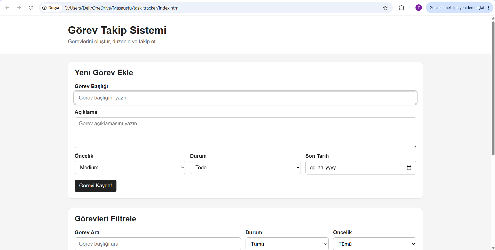
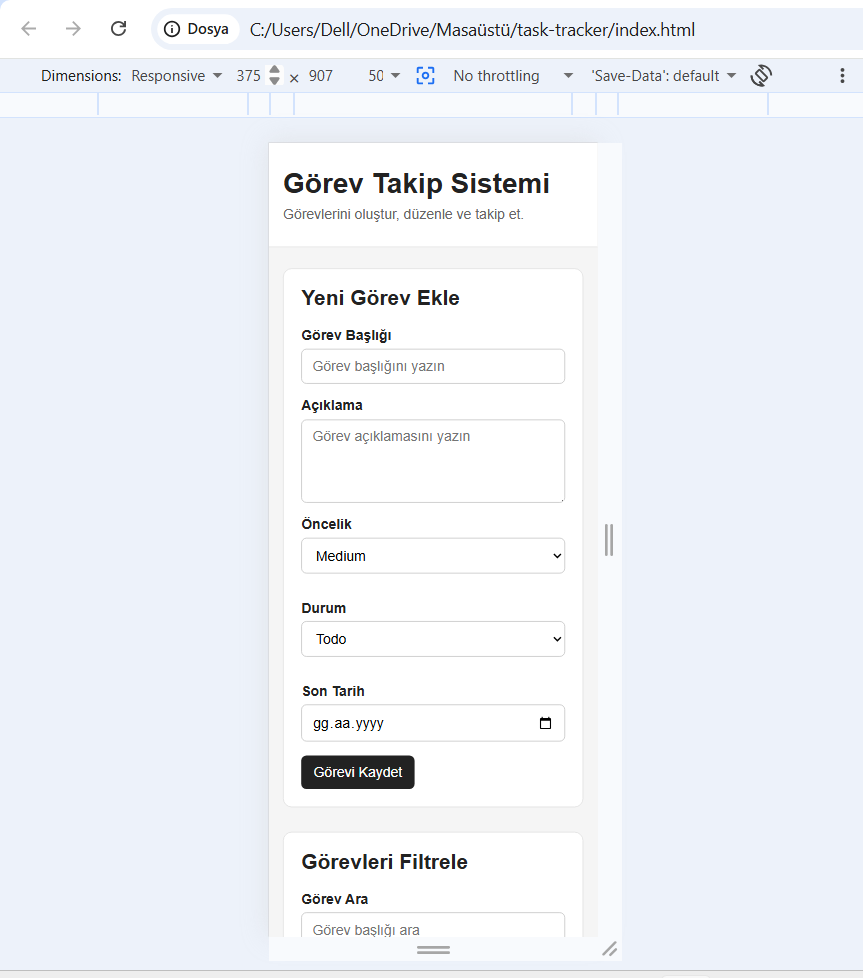
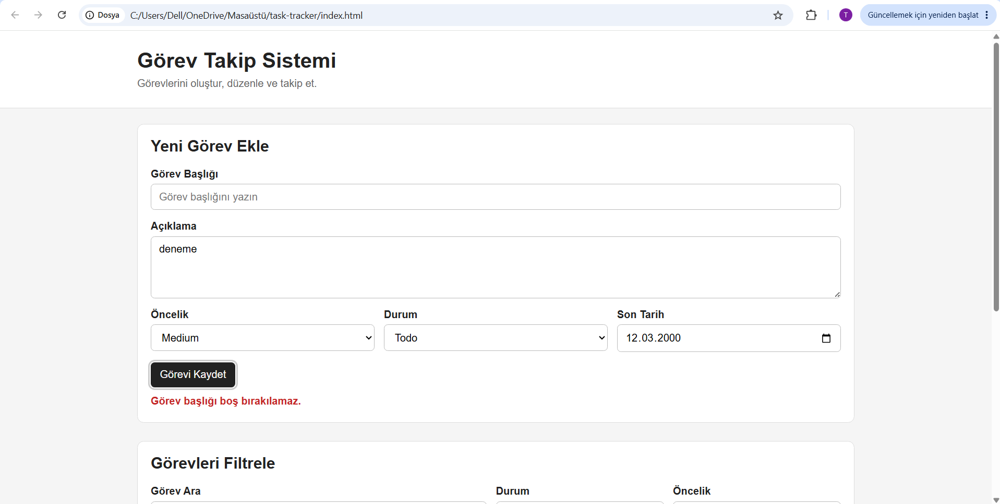
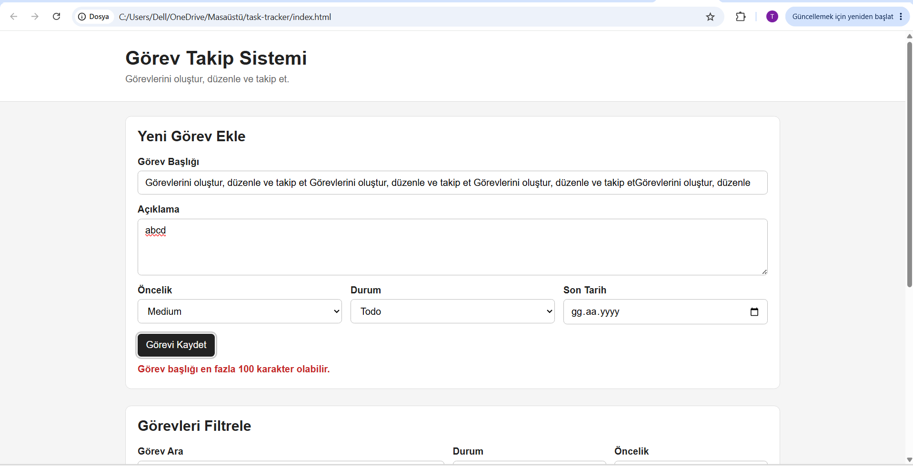
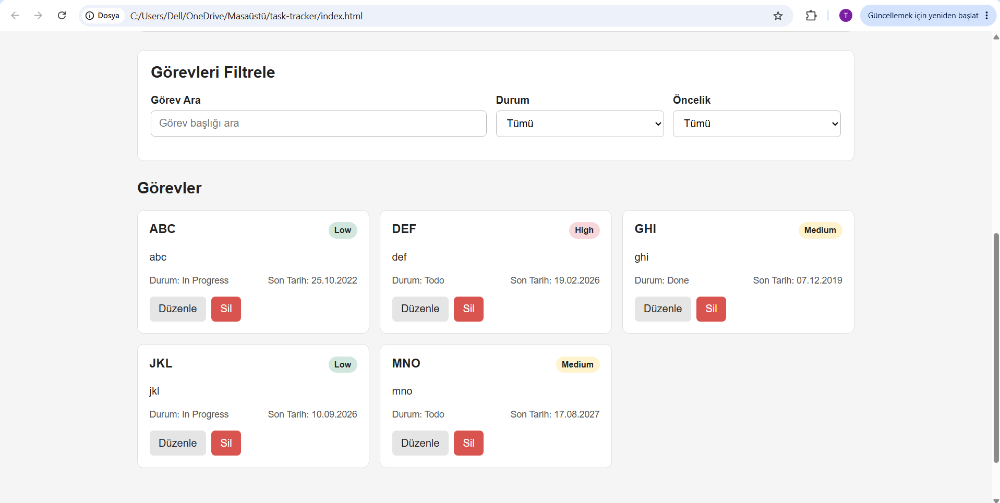
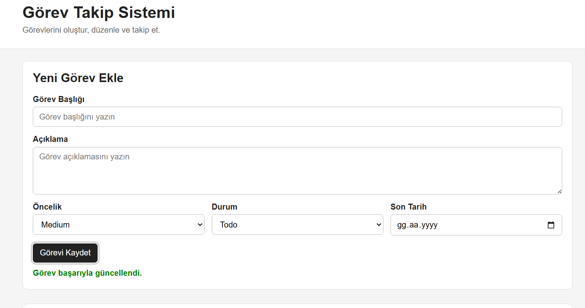
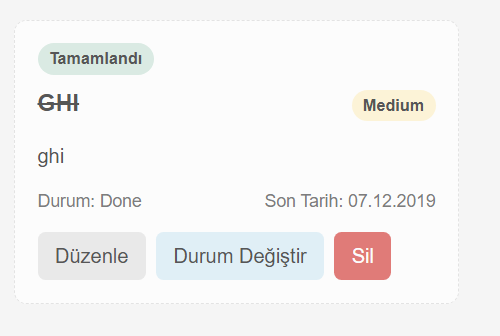
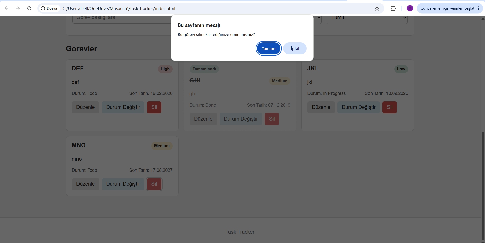
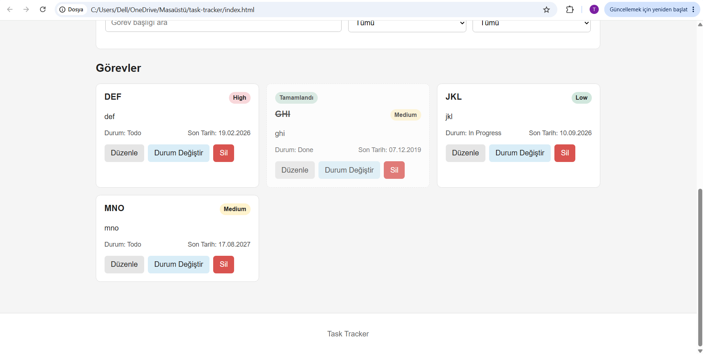

# Task Tracker - Görev Takip Sistemi

## Projenin Amacı

Bu projenin amacı kullanıcıların günlük görevlerini oluşturabildiği, görüntüleyebildiği, düzenleyebildiği ve takip edebildiği basit bir görev takip sistemi geliştirmektir.

Uygulamada görevlerin öncelik, durum ve son tarih bilgileri tutulacaktır. Kullanıcılar görevler arasında arama ve filtreleme yapabilecek ve görev verileri LocalStorage kullanılarak tarayıcıda saklanacaktır.

İlk aşamada temel ve çalışan bir MVP oluşturulacak, daha gelişmiş özellikler sonraki sürümlerde eklenecektir.

## User Stories

1. Kullanıcı olarak yeni görev eklemek istiyorum, böylece yapacaklarımı kaydedebilirim.

2. Kullanıcı olarak oluşturduğum görevleri listelemek istiyorum, böylece tüm görevlerimi görebilirim.

3. Kullanıcı olarak bir görevi düzenlemek istiyorum, böylece yanlış veya değişen bilgileri güncelleyebilirim.

4. Kullanıcı olarak bir görevi silmek istiyorum, böylece artık gerekli olmayan görevleri kaldırabilirim.

5. Kullanıcı olarak görevin durumunu değiştirmek istiyorum, böylece yapılacak, devam eden ve tamamlanan görevleri takip edebilirim.

6. Kullanıcı olarak göreve öncelik vermek istiyorum, böylece önemli görevleri diğerlerinden ayırabilirim.

7. Kullanıcı olarak göreve son tarih eklemek istiyorum, böylece görevimi ne zamana kadar tamamlamam gerektiğini görebilirim.

8. Kullanıcı olarak görevler arasında arama yapmak istiyorum, böylece istediğim göreve hızlıca ulaşabilirim.

9. Kullanıcı olarak görevleri durum veya önceliğe göre filtrelemek istiyorum, böylece yalnızca ilgilendiğim görevleri görüntüleyebilirim.

10. Kullanıcı olarak sayfayı yenilediğimde görevlerimin kaybolmamasını istiyorum, böylece daha önce oluşturduğum görevleri tekrar görebilirim.

## MVP Özellikleri

İlk sürümde aşağıdaki özelliklerin tamamlanması hedeflenmektedir:

- Görev ekleme
- Görev listeleme
- Görev düzenleme
- Görev silme
- Görev durumunu değiştirme
- Öncelik seçme
- Son tarih belirleme
- Görev arama
- Görev filtreleme
- LocalStorage ile verileri saklama
- Form doğrulama
- Boş liste mesajı

## Sonraki Sürümlerde Eklenebilecek Özellikler

- Kullanıcı hesabı ve giriş sistemi
- Backend ve gerçek veritabanı
- Görev kategorileri
- Etiket sistemi
- Sürükle-bırak görev yönetimi
- Bildirim ve hatırlatıcılar
- Karanlık mod
- Görev istatistikleri
- Görevleri sıralama
- Bulut senkronizasyonu

## Task Veri Modeli

Örnek bir görev aşağıdaki yapıda tutulacaktır:

```json
{
  "id": 1,
  "title": "Staj raporunu tamamla",
  "description": "Günlük staj raporunu hazırlayıp kontrol et",
  "priority": "high",
  "status": "todo",
  "dueDate": "2026-09-01",
  "createdAt": "2026-08-29T18:00:00.000Z"
}
```

## Veri Alanları

| Alan | Veri Tipi | Zorunlu | Açıklama |
| --- | --- | --- | --- |
| id | Number | Evet | Görevin benzersiz kimliği |
| title | String | Evet | Görev başlığı |
| description | String | Hayır | Görevin ayrıntılı açıklaması |
| priority | String | Evet | Görevin öncelik seviyesi |
| status | String | Evet | Görevin mevcut durumu |
| dueDate | String / Date | Evet | Görevin son tarihi |
| createdAt | String / Date | Evet | Görevin oluşturulma zamanı |

## Doğrulama Kuralları

- Başlık boş olamaz.
- Başlık en fazla 100 karakter olabilir.
- Öncelik yalnızca `low`, `medium` veya `high` olabilir.
- Durum yalnızca `todo`, `in-progress` veya `done` olabilir.
- Son tarih geçerli bir tarih olmalıdır.
- Görev oluşturulurken benzersiz bir `id` oluşturulmalıdır.
- `createdAt` değeri görev oluşturulduğunda otomatik olarak belirlenmelidir.

## Kullanıcı Akışı

Temel kullanıcı akışı şu şekilde planlanmıştır:

Kullanıcı uygulamayı açar  
→ Görev listesini görüntüler  
→ Yeni görev formunu doldurur  
→ Form doğrulaması yapılır  
→ Görev oluşturulur  
→ Görev listeye eklenir  
→ Veri LocalStorage'a kaydedilir  
→ Kullanıcı görevi düzenleyebilir, silebilir veya durumunu değiştirebilir  
→ Arama ve filtreleme ile istediği görevleri görüntüleyebilir

## Dosya Yapısı

```text
task-tracker/
│
├── index.html
├── README.md
│
├── css/
│   └── style.css
│
└── js/
    ├── app.js
    ├── storage.js
    └── ui.js
```

### Dosyaların Görevleri

- `index.html`: Uygulamanın HTML yapısı
- `css/style.css`: Uygulamanın görünümü
- `js/app.js`: Ana uygulama mantığı ve event işlemleri
- `js/storage.js`: LocalStorage işlemleri
- `js/ui.js`: DOM ve kullanıcı arayüzü işlemleri

## Backlog / Yapılacaklar

- [ ] Ana HTML yapısını oluştur
- [ ] Görev ekleme formunu oluştur
- [ ] Task veri modelini uygula
- [ ] Form doğrulamalarını ekle
- [ ] Görevleri ekranda listele
- [ ] Görev düzenleme özelliğini ekle
- [ ] Görev silme özelliğini ekle
- [ ] Görev durumunu değiştirme özelliğini ekle
- [ ] Öncelik seçimini ekle
- [ ] Son tarih alanını ekle
- [ ] Görev arama özelliğini ekle
- [ ] Filtreleme özelliğini ekle
- [ ] LocalStorage kaydetme/yükleme işlemlerini ekle
- [ ] Boş liste görünümünü oluştur
- [ ] Hata ve kullanıcı mesajlarını ekle
- [ ] Uygulamayı farklı senaryolarla test et

## MVP Yaklaşımı

İlk sürümde temel görev yönetimi özelliklerinin eksiksiz ve çalışır olması hedeflenmektedir. İlk sürüm tamamlanmadan kullanıcı hesabı, backend, bildirim veya gelişmiş istatistik gibi ek özelliklere geçilmeyecektir.

## Gün 24 - Responsive Arayüz

Görev Takip Sistemi için JavaScript eklenmeden önce statik ve responsive kullanıcı arayüzü oluşturdum.

Arayüzde:

- Semantik `header`, `main`, `section` ve `footer` yapısı
- Görev ekleme formu
- Başlık, açıklama, öncelik, durum ve son tarih alanları
- Arama alanı
- Durum ve öncelik filtreleri
- Üç statik görev kartı
- Düzenle ve Sil butonları
- High, Medium ve Low öncelik badge'leri
- Boş liste görünümü
- Klavye kullanıcıları için görünür focus durumları
- Butonlarda hover durumları
- Mobile-first responsive tasarım

hazırladım.

Mobil görünümde form, filtreler ve görev kartları tek sütun halinde görüntülenmektedir. Geniş ekranlarda görev kartları grid yapısına geçmektedir.

### Masaüstü Görünümü



### 375px Mobil Görünüm



## Gün 25 - Görev Ekleme ve Dinamik Listeleme

Görev Takip Sistemi'nin statik görev kartlarını kaldırarak görevlerin JavaScript üzerinden dinamik olarak oluşturulmasını sağladım.

### Görev Veri Modeli

Yeni görevler aşağıdaki alanlardan oluşmaktadır:

- `id`
- `title`
- `description`
- `priority`
- `status`
- `dueDate`
- `createdAt`

Görevler form üzerinden oluşturulduktan sonra `tasks` dizisine eklenmekte ve LocalStorage içerisinde saklanmaktadır.

### Form Akışı

Form gönderildiğinde aşağıdaki işlem sırasını uyguladım:

1. Formun submit event'ini yakaladım.
2. `preventDefault()` ile sayfanın yenilenmesini engelledim.
3. Form değerlerini aldım ve metin alanlarında `trim()` kullandım.
4. Verileri doğruladım.
5. Geçerli verilerle yeni task object oluşturdum.
6. Yeni görevi `tasks` dizisine ekledim.
7. Diziyi LocalStorage'a kaydettim.
8. `renderTasks()` fonksiyonuyla görev listesini yeniden oluşturdum.
9. Form alanlarını temizledim.
10. Kullanıcıya kısa süreli başarı mesajı gösterdim.

### Doğrulama Kontrolleri

Görev başlığının boş bırakılmasını engelledim.

Başlığın 100 karakterden uzun olması durumunda kullanıcıya hata mesajı gösterdim.

Priority ve status değerlerinin belirlenen seçeneklerden biri olmasını kontrol ettim.

Son tarih bilgisinin geçerli bir tarih olmasını doğruladım.

### Dinamik Görev Kartları

`renderTasks(tasks)` fonksiyonu ile görev kartlarını JavaScript kullanarak dinamik olarak oluşturdum.

Her kartta:

- Görev başlığı
- Açıklama
- Öncelik
- Durum
- Son tarih
- Düzenle butonu
- Sil butonu

görüntülenmektedir.

### LocalStorage

Görev listesini `JSON.stringify()` kullanarak LocalStorage içerisinde sakladım.

Sayfa açıldığında verileri `JSON.parse()` ile tekrar JavaScript dizisine dönüştürdüm.

Sayfayı yenileyerek eklediğim beş görevin kaybolmadığını ve LocalStorage üzerinden tekrar yüklendiğini doğruladım.

### Boş Liste Durumu

Görev bulunmadığında kullanıcıya:

`Henüz görev bulunmuyor`

mesajının gösterilmesini sağladım.

### Testler

- Boş görev başlığı kontrol edildi.
- 100 karakterden uzun başlık kontrol edildi.
- Beş farklı görev başarıyla eklendi.
- Low, Medium ve High öncelikleri test edildi.
- Todo, In Progress ve Done durumları test edildi.
- Sayfa yenilenerek LocalStorage kalıcılığı doğrulandı.

### Gün 25 Ekran Görüntüleri

#### Form Doğrulama



#### 100 Karakter Kontrolü



#### Dinamik Görev Listesi



## Gün 26 - CRUD İşlemleri

Bugünkü çalışmada Görev Takip Sistemi üzerinde CRUD işlemlerini tamamladım.

CRUD yapısı:

- **Create:** Yeni görev ekleme
- **Read:** Görevleri listeleme
- **Update:** Mevcut görevi düzenleme ve durumunu değiştirme
- **Delete:** Görevi onay alarak silme

### Görev Düzenleme

Her görev kartına `Düzenle` butonu ekledim.

Düzenleme işlemi sırasında görev `id` değeri kullanılarak `find()` ile bulundu ve mevcut bilgileri forma aktarıldı.

Düzenleme modunu takip etmek için `editingTaskId` değişkenini kullandım.

Düzenleme modunda formun gönderme butonunun metni:

`Görevi Güncelle`

olarak değiştirildi.

Güncelleme tamamlandıktan sonra form tekrar normal görev ekleme moduna döndürüldü.

### Görev Silme

Her görev kartına `Sil` butonu ekledim.

Görev silinmeden önce kullanıcıdan `confirm()` ile onay alınmasını sağladım.

Görevin dizideki konumunu bulmak için `findIndex()` kullandım.

Kullanıcı işlemi onayladığında görev:

1. `tasks` dizisinden kaldırıldı.
2. LocalStorage yeniden güncellendi.
3. Görev listesi tekrar oluşturuldu.

Kullanıcı işlemi iptal ettiğinde görev silinmedi.

### Durum Değiştirme

Her görev kartına `Durum Değiştir` butonu ekledim.

Görev durumları aşağıdaki sırayla değişmektedir:

```text
Todo
→ In Progress
→ Done
→ Todo
```

Her durum değişikliğinde görev dizisini ve LocalStorage verisini güncelledim.

### Tamamlanan Görev Görünümü

`done` durumundaki görev kartlarını diğer görevlerden görsel olarak ayırdım.

Tamamlanan görevlerde:

- `Tamamlandı` etiketi gösterildi.
- Görev başlığının üzeri çizildi.
- Kart daha soluk bir görünüm aldı.

### Hata Kontrolü

Düzenleme, silme veya durum değiştirme sırasında verilen `id` ile eşleşen görev bulunamazsa uygulamanın hata vermeden işlemi sonlandırmasını sağladım.

### CRUD Testleri

- Yeni görev ekleme testi başarılı.
- Görev düzenleme testi başarılı.
- Düzenleme sonrası yeni görev oluşturulmadığı doğrulandı.
- Görev silme işleminde onay penceresi test edildi.
- Silme işleminde İptal seçildiğinde görevin korunduğu doğrulandı.
- Silme onaylandığında görevin listeden kaldırıldığı doğrulandı.
- Todo → In Progress → Done durum geçişleri test edildi.
- Done durumundaki tamamlandı görünümü kontrol edildi.
- Tüm işlemlerden sonra sayfa yenilenerek LocalStorage kalıcılığı doğrulandı.

### Gün 26 Ekran Görüntüleri

#### Görev Düzenleme Modu



#### Tamamlanan Görev Görünümü



#### Görev Silme Onayı



#### CRUD Son Durum

