# Task Tracker - Görev Takip Sistemi

## Projenin Amacı

Bu projenin amacı kullanıcıların günlük görevlerini oluşturabildiği, görüntüleyebildiği, düzenleyebildiği ve takip edebildiği basit bir görev takip sistemi geliştirmektir.

Uygulamada görevlerin öncelik, durum ve son tarih bilgileri tutulacaktır. Kullanıcılar görevler arasında arama ve filtreleme yapabilecek ve görev verileri LocalStorage kullanılarak tarayıcıda saklanacaktır.

İlk aşamada temel ve çalışan bir MVP oluşturulacak, daha gelişmiş özellikler sonraki sürümlerde eklenecektir.

## User Stories

1. Kullanıcı olarak yeni görev eklemek istiyorum, böylece yapacaklarımı kaydedebilirim.

2. Kullanıcı olarak oluşturduğum görevleri listelemek istiyorum, böylece tüm görevlerimi görebilirim.

3. Kullanıcı olarak bir görevi düzenlemek istiyorum, böylece yanlış veya değişen bilgileri güncelleyebilirim.

4. Kullanıcı olarak bir görevi silmek istiyorum, böylece artık gerekli olmayan görevleri kaldırabilirim.

5. Kullanıcı olarak görevin durumunu değiştirmek istiyorum, böylece yapılacak, devam eden ve tamamlanan görevleri takip edebilirim.

6. Kullanıcı olarak göreve öncelik vermek istiyorum, böylece önemli görevleri diğerlerinden ayırabilirim.

7. Kullanıcı olarak göreve son tarih eklemek istiyorum, böylece görevimi ne zamana kadar tamamlamam gerektiğini görebilirim.

8. Kullanıcı olarak görevler arasında arama yapmak istiyorum, böylece istediğim göreve hızlıca ulaşabilirim.

9. Kullanıcı olarak görevleri durum veya önceliğe göre filtrelemek istiyorum, böylece yalnızca ilgilendiğim görevleri görüntüleyebilirim.

10. Kullanıcı olarak sayfayı yenilediğimde görevlerimin kaybolmamasını istiyorum, böylece daha önce oluşturduğum görevleri tekrar görebilirim.

## MVP Özellikleri

İlk sürümde aşağıdaki özelliklerin tamamlanması hedeflenmektedir:

- Görev ekleme
- Görev listeleme
- Görev düzenleme
- Görev silme
- Görev durumunu değiştirme
- Öncelik seçme
- Son tarih belirleme
- Görev arama
- Görev filtreleme
- LocalStorage ile verileri saklama
- Form doğrulama
- Boş liste mesajı

## Sonraki Sürümlerde Eklenebilecek Özellikler

- Kullanıcı hesabı ve giriş sistemi
- Backend ve gerçek veritabanı
- Görev kategorileri
- Etiket sistemi
- Sürükle-bırak görev yönetimi
- Bildirim ve hatırlatıcılar
- Karanlık mod
- Görev istatistikleri
- Görevleri sıralama
- Bulut senkronizasyonu

## Task Veri Modeli

Örnek bir görev aşağıdaki yapıda tutulacaktır:

```json
{
  "id": 1,
  "title": "Staj raporunu tamamla",
  "description": "Günlük staj raporunu hazırlayıp kontrol et",
  "priority": "high",
  "status": "todo",
  "dueDate": "2026-09-01",
  "createdAt": "2026-08-29T18:00:00.000Z"
}
```

## Veri Alanları

| Alan | Veri Tipi | Zorunlu | Açıklama |
| --- | --- | --- | --- |
| id | Number | Evet | Görevin benzersiz kimliği |
| title | String | Evet | Görev başlığı |
| description | String | Hayır | Görevin ayrıntılı açıklaması |
| priority | String | Evet | Görevin öncelik seviyesi |
| status | String | Evet | Görevin mevcut durumu |
| dueDate | String / Date | Evet | Görevin son tarihi |
| createdAt | String / Date | Evet | Görevin oluşturulma zamanı |

## Doğrulama Kuralları

- Başlık boş olamaz.
- Başlık en fazla 100 karakter olabilir.
- Öncelik yalnızca `low`, `medium` veya `high` olabilir.
- Durum yalnızca `todo`, `in-progress` veya `done` olabilir.
- Son tarih geçerli bir tarih olmalıdır.
- Görev oluşturulurken benzersiz bir `id` oluşturulmalıdır.
- `createdAt` değeri görev oluşturulduğunda otomatik olarak belirlenmelidir.

## Kullanıcı Akışı

Temel kullanıcı akışı şu şekilde planlanmıştır:

Kullanıcı uygulamayı açar  
→ Görev listesini görüntüler  
→ Yeni görev formunu doldurur  
→ Form doğrulaması yapılır  
→ Görev oluşturulur  
→ Görev listeye eklenir  
→ Veri LocalStorage'a kaydedilir  
→ Kullanıcı görevi düzenleyebilir, silebilir veya durumunu değiştirebilir  
→ Arama ve filtreleme ile istediği görevleri görüntüleyebilir

## Dosya Yapısı

```text
task-tracker/
│
├── index.html
├── README.md
│
├── css/
│   └── style.css
│
└── js/
    ├── app.js
    ├── storage.js
    └── ui.js
```

### Dosyaların Görevleri

- `index.html`: Uygulamanın HTML yapısı
- `css/style.css`: Uygulamanın görünümü
- `js/app.js`: Ana uygulama mantığı ve event işlemleri
- `js/storage.js`: LocalStorage işlemleri
- `js/ui.js`: DOM ve kullanıcı arayüzü işlemleri

## Backlog / Yapılacaklar

- [ ] Ana HTML yapısını oluştur
- [ ] Görev ekleme formunu oluştur
- [ ] Task veri modelini uygula
- [ ] Form doğrulamalarını ekle
- [ ] Görevleri ekranda listele
- [ ] Görev düzenleme özelliğini ekle
- [ ] Görev silme özelliğini ekle
- [ ] Görev durumunu değiştirme özelliğini ekle
- [ ] Öncelik seçimini ekle
- [ ] Son tarih alanını ekle
- [ ] Görev arama özelliğini ekle
- [ ] Filtreleme özelliğini ekle
- [ ] LocalStorage kaydetme/yükleme işlemlerini ekle
- [ ] Boş liste görünümünü oluştur
- [ ] Hata ve kullanıcı mesajlarını ekle
- [ ] Uygulamayı farklı senaryolarla test et

## MVP Yaklaşımı

İlk sürümde temel görev yönetimi özelliklerinin eksiksiz ve çalışır olması hedeflenmektedir. İlk sürüm tamamlanmadan kullanıcı hesabı, backend, bildirim veya gelişmiş istatistik gibi ek özelliklere geçilmeyecektir.

## Gün 24 - Responsive Arayüz

Görev Takip Sistemi için JavaScript eklenmeden önce statik ve responsive kullanıcı arayüzü oluşturdum.

Arayüzde:

- Semantik `header`, `main`, `section` ve `footer` yapısı
- Görev ekleme formu
- Başlık, açıklama, öncelik, durum ve son tarih alanları
- Arama alanı
- Durum ve öncelik filtreleri
- Üç statik görev kartı
- Düzenle ve Sil butonları
- High, Medium ve Low öncelik badge'leri
- Boş liste görünümü
- Klavye kullanıcıları için görünür focus durumları
- Butonlarda hover durumları
- Mobile-first responsive tasarım

hazırladım.

Mobil görünümde form, filtreler ve görev kartları tek sütun halinde görüntülenmektedir. Geniş ekranlarda görev kartları grid yapısına geçmektedir.

### Masaüstü Görünümü


### 375px Mobil Görünüm


## Gün 25 - Görev Ekleme ve Dinamik Listeleme

Görev Takip Sistemi'nin statik görev kartlarını kaldırarak görevlerin JavaScript üzerinden dinamik olarak oluşturulmasını sağladım.

### Görev Veri Modeli

Yeni görevler aşağıdaki alanlardan oluşmaktadır:

- `id`
- `title`
- `description`
- `priority`
- `status`
- `dueDate`
- `createdAt`

Görevler form üzerinden oluşturulduktan sonra `tasks` dizisine eklenmekte ve LocalStorage içerisinde saklanmaktadır.

### Form Akışı

Form gönderildiğinde aşağıdaki işlem sırasını uyguladım:

1. Formun submit event'ini yakaladım.
2. `preventDefault()` ile sayfanın yenilenmesini engelledim.
3. Form değerlerini aldım ve metin alanlarında `trim()` kullandım.
4. Verileri doğruladım.
5. Geçerli verilerle yeni task object oluşturdum.
6. Yeni görevi `tasks` dizisine ekledim.
7. Diziyi LocalStorage'a kaydettim.
8. `renderTasks()` fonksiyonuyla görev listesini yeniden oluşturdum.
9. Form alanlarını temizledim.
10. Kullanıcıya kısa süreli başarı mesajı gösterdim.

### Doğrulama Kontrolleri

Görev başlığının boş bırakılmasını engelledim.

Başlığın 100 karakterden uzun olması durumunda kullanıcıya hata mesajı gösterdim.

Priority ve status değerlerinin belirlenen seçeneklerden biri olmasını kontrol ettim.

Son tarih bilgisinin geçerli bir tarih olmasını doğruladım.

### Dinamik Görev Kartları

`renderTasks(tasks)` fonksiyonu ile görev kartlarını JavaScript kullanarak dinamik olarak oluşturdum.

Her kartta:

- Görev başlığı
- Açıklama
- Öncelik
- Durum
- Son tarih
- Düzenle butonu
- Sil butonu

görüntülenmektedir.

### LocalStorage

Görev listesini `JSON.stringify()` kullanarak LocalStorage içerisinde sakladım.

Sayfa açıldığında verileri `JSON.parse()` ile tekrar JavaScript dizisine dönüştürdüm.

Sayfayı yenileyerek eklediğim beş görevin kaybolmadığını ve LocalStorage üzerinden tekrar yüklendiğini doğruladım.

### Boş Liste Durumu

Görev bulunmadığında kullanıcıya:

`Henüz görev bulunmuyor`

mesajının gösterilmesini sağladım.

### Testler

- Boş görev başlığı kontrol edildi.
- 100 karakterden uzun başlık kontrol edildi.
- Beş farklı görev başarıyla eklendi.
- Low, Medium ve High öncelikleri test edildi.
- Todo, In Progress ve Done durumları test edildi.
- Sayfa yenilenerek LocalStorage kalıcılığı doğrulandı.

### Gün 25 Ekran Görüntüleri

#### Form Doğrulama


#### 100 Karakter Kontrolü


#### Dinamik Görev Listesi


## Gün 26 - CRUD İşlemleri

Bugünkü çalışmada Görev Takip Sistemi üzerinde CRUD işlemlerini tamamladım.

CRUD yapısı:

- **Create:** Yeni görev ekleme
- **Read:** Görevleri listeleme
- **Update:** Mevcut görevi düzenleme ve durumunu değiştirme
- **Delete:** Görevi onay alarak silme

### Görev Düzenleme

Her görev kartına `Düzenle` butonu ekledim.

Düzenleme işlemi sırasında görev `id` değeri kullanılarak `find()` ile bulundu ve mevcut bilgileri forma aktarıldı.

Düzenleme modunu takip etmek için `editingTaskId` değişkenini kullandım.

Düzenleme modunda formun gönderme butonunun metni:

`Görevi Güncelle`

olarak değiştirildi.

Güncelleme tamamlandıktan sonra form tekrar normal görev ekleme moduna döndürüldü.

### Görev Silme

Her görev kartına `Sil` butonu ekledim.

Görev silinmeden önce kullanıcıdan `confirm()` ile onay alınmasını sağladım.

Görevin dizideki konumunu bulmak için `findIndex()` kullandım.

Kullanıcı işlemi onayladığında görev:

1. `tasks` dizisinden kaldırıldı.
2. LocalStorage yeniden güncellendi.
3. Görev listesi tekrar oluşturuldu.

Kullanıcı işlemi iptal ettiğinde görev silinmedi.

### Durum Değiştirme

Her görev kartına `Durum Değiştir` butonu ekledim.

Görev durumları aşağıdaki sırayla değişmektedir:

```text
Todo
→ In Progress
→ Done
→ Todo
```

Her durum değişikliğinde görev dizisini ve LocalStorage verisini güncelledim.

### Tamamlanan Görev Görünümü

`done` durumundaki görev kartlarını diğer görevlerden görsel olarak ayırdım.

Tamamlanan görevlerde:

- `Tamamlandı` etiketi gösterildi.
- Görev başlığının üzeri çizildi.
- Kart daha soluk bir görünüm aldı.

### Hata Kontrolü

Düzenleme, silme veya durum değiştirme sırasında verilen `id` ile eşleşen görev bulunamazsa uygulamanın hata vermeden işlemi sonlandırmasını sağladım.

### CRUD Testleri

- Yeni görev ekleme testi başarılı.
- Görev düzenleme testi başarılı.
- Düzenleme sonrası yeni görev oluşturulmadığı doğrulandı.
- Görev silme işleminde onay penceresi test edildi.
- Silme işleminde İptal seçildiğinde görevin korunduğu doğrulandı.
- Silme onaylandığında görevin listeden kaldırıldığı doğrulandı.
- Todo → In Progress → Done durum geçişleri test edildi.
- Done durumundaki tamamlandı görünümü kontrol edildi.
- Tüm işlemlerden sonra sayfa yenilenerek LocalStorage kalıcılığı doğrulandı.

### Gün 26 Ekran Görüntüleri

#### Görev Düzenleme Modu


#### Tamamlanan Görev Görünümü


#### Görev Silme Onayı


#### CRUD Son Durum


## Gün 27 - Görev Arama, Filtreleme ve Sıralama

Bugünkü çalışmada Görev Takip Sistemi'ne arama, filtreleme ve sıralama özellikleri ekledim.

### Arama

Görev başlığı ve açıklaması üzerinde büyük-küçük harf duyarsız arama yapılmasını sağladım.

Arama metnini `trim()` ve `toLowerCase()` kullanarak normalize ettim.

### Filtreleme

Görevleri aşağıdaki alanlara göre filtreleyebilecek yapı oluşturdum:

- Durum: Todo, In Progress, Done
- Öncelik: Low, Medium, High

Arama, durum filtresi ve öncelik filtresinin aynı anda çalışmasını `applyFilters()` fonksiyonu içerisinde yönettim.

Filtreleme sırasında ana `tasks` dizisini değiştirmeden ayrı bir filtrelenmiş liste kullandım.

### Sonuç Sayısı

Kullanıcıya görüntülenen görev sayısını göstermek için:

`5 görevden 2 tanesi gösteriliyor`

şeklinde sonuç bilgisi ekledim.

### Tarihe Göre Sıralama

Görevlerin son tarihlerine göre artan şekilde sıralanmasını sağladım.

Geçerli tarih değerlerini `Date` nesnesine dönüştürerek karşılaştırdım. Boş veya geçersiz tarihlerin uygulamada hata oluşturmamasını sağladım.

### Gecikmiş Görevler

Son tarihi geçmiş ve henüz `done` durumuna gelmemiş görevlerde `Gecikti` etiketi gösterdim.

Tamamlanan görevlerde gecikme etiketi gösterilmemektedir.

### Boş Filtre Sonucu

Filtre veya arama sonucunda eşleşen görev bulunmadığında:

`Filtrelere uygun görev bulunamadı`

mesajının gösterilmesini sağladım.

### Form Doğrulama

Başlık alanına yalnızca boşluk girilmesini engelledim. Başlık doğrulama mesajını ilgili input alanına yakın şekilde gösterdim.

### Test Senaryoları

1. Görev başlığına göre arama test edildi.
2. Görev açıklamasına göre arama test edildi.
3. Büyük-küçük harf duyarsız arama test edildi.
4. Durum filtresi test edildi.
5. Öncelik filtresi test edildi.
6. Arama, durum ve öncelik filtrelerinin birlikte çalışması test edildi.
7. Filtre sonucu bulunamayan senaryo test edildi.
8. Son tarihe göre artan sıralama test edildi.
9. Sonuç sayısının filtrelere göre değiştiği doğrulandı.
10. Gecikmiş ve tamamlanmamış görevlerde `Gecikti` etiketinin gösterildiği kontrol edildi.

### Gün 27 Ekran Görüntüleri

#### Arama ve Sonuç Sayısı

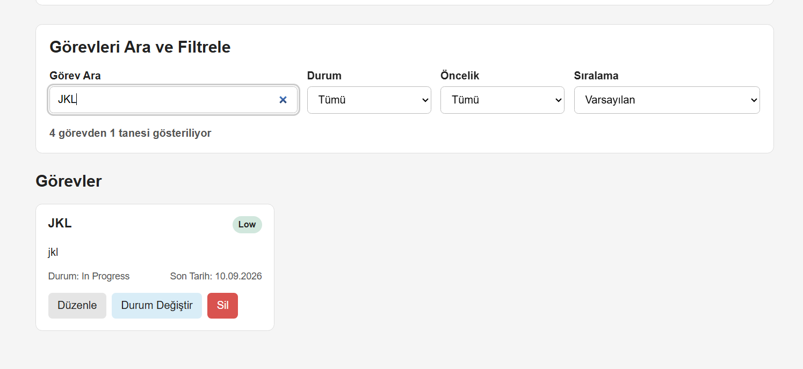

#### Çoklu Filtreleme

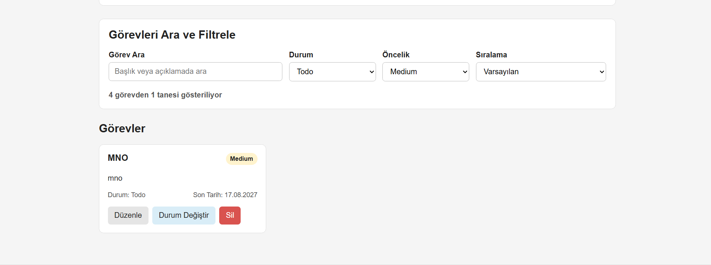

#### Filtre Sonucu Bulunamadı

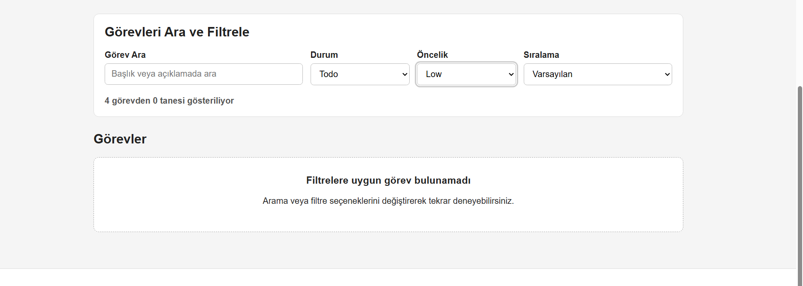

#### Tarih Sıralama ve Geciken Görev

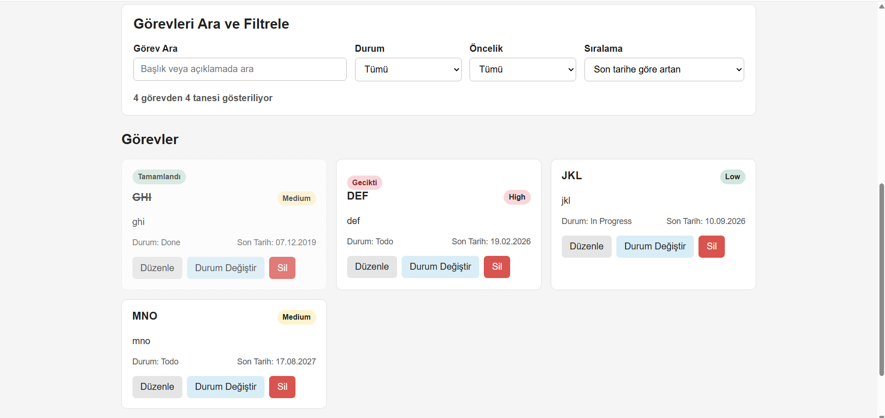


## Gün 28 - JavaScript Refactor ve Modüler Yapı

Bugünkü çalışmada çalışan Görev Takip Sistemi kodunu özellikleri bozmadan yeniden düzenledim. JavaScript kodunu veri saklama, kullanıcı arayüzü ve uygulama akışı sorumluluklarına göre modüllere ayırdım.

### Refactor Öncesi Dosya Yapısı

```text
js/
├── app.js
├── storage.js
└── ui.js
```

Dosyalar ayrı olsa da birbirlerine normal script etiketleriyle bağlıydı ve fonksiyonlar global alanda kullanılıyordu.

### Refactor Sonrası Dosya Yapısı

```text
task-tracker/
├── index.html
├── README.md
├── css/
│   └── style.css
├── js/
│   ├── app.js
│   ├── storage.js
│   └── ui.js
└── screenshots/
```

JavaScript dosyalarının sorumluluklarını şu şekilde ayırdım:

- `storage.js`: LocalStorage üzerinden görevleri yükleme ve kaydetme
- `ui.js`: Görev kartlarını oluşturma, DOM yardımcıları ve kullanıcı mesajları
- `app.js`: Event yönetimi, form işlemleri, CRUD işlemleri, arama ve filtreleme akışı

### ES Modules

`index.html` içerisinde JavaScript dosyasını ES Module olarak yükledim:

```html
<script type="module" src="js/app.js"></script>
```

Dosyalar arasında fonksiyon ve sabit paylaşımı için `export` ve `import` kullandım.

### Kod Düzenlemeleri

Uzun fonksiyonları daha küçük ve tek sorumluluklu fonksiyonlara ayırdım. Tekrarlanan görev bulma, tarih kontrolü ve filtreleme işlemlerini yardımcı fonksiyonlara taşıdım.

`todo`, `in-progress` ve `done` gibi tekrar eden durum değerlerini ortak sabitlerde tuttum. Değişken ve fonksiyon isimlerini daha açıklayıcı hale getirdim ve kullanılmayan kodları temizledim.

Görev kartlarındaki butonlar için ayrı ayrı event eklemek yerine event delegation yaklaşımı kullandım.

### Refactor Sonrası Test Kontrol Listesi

- [x] Yeni görev ekleme
- [x] Görev düzenleme
- [x] Görev silme ve onay işlemi
- [x] Görev durumunu değiştirme
- [x] LocalStorage kalıcılığı
- [x] Başlık ve açıklamada arama
- [x] Durum filtresi
- [x] Öncelik filtresi
- [x] Çoklu filtreleme
- [x] Son tarihe göre sıralama
- [x] Gecikmiş görev görünümü
- [x] Sayfa yenileme sonrası verilerin korunması

Refactor sonrasında uygulamanın önceki özelliklerinin çalışmaya devam ettiğini doğruladım.

### Gün 28 Ekran Görüntüleri

#### Modüler Dosya Yapısı

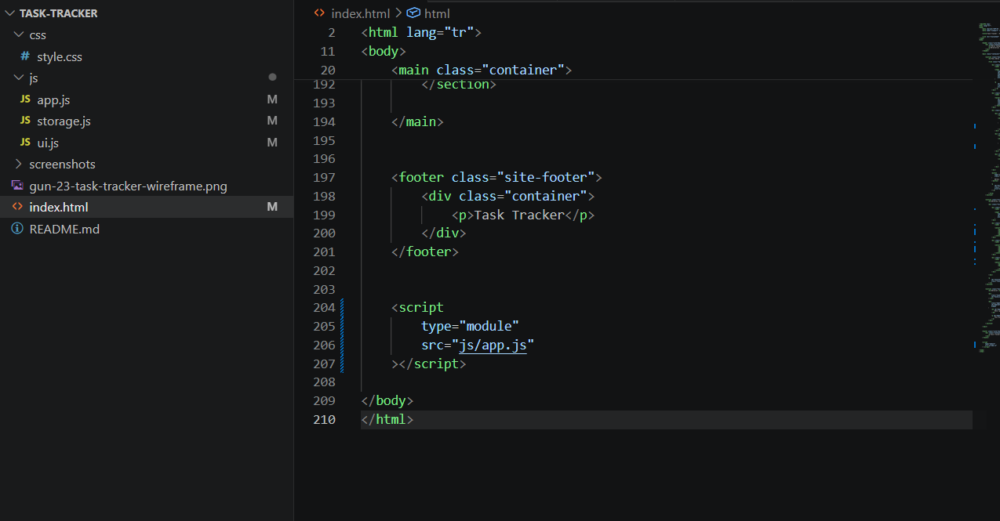

#### Refactor Sonrası Uygulama

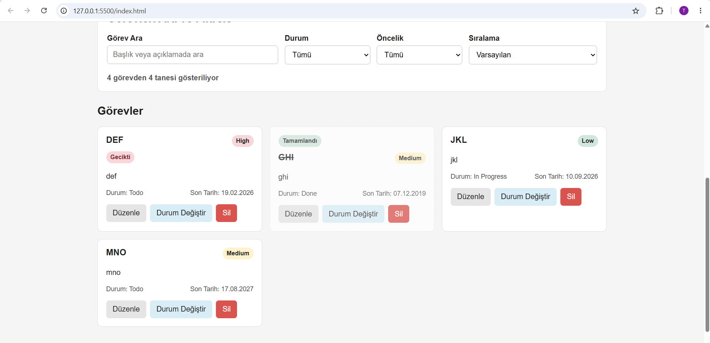

#### Refactor Sonrası Filtreleme

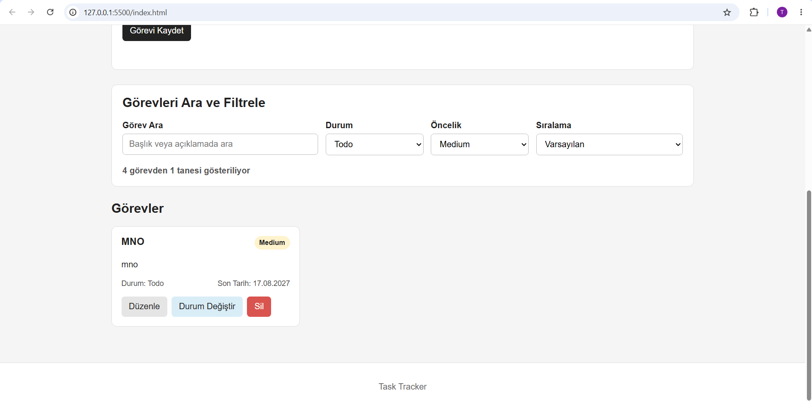


## Proje Hakkında

Task Tracker, kullanıcıların görev oluşturmasını, düzenlemesini, silmesini, durumlarını değiştirmesini ve görevlerini filtreleyerek takip etmesini sağlayan JavaScript tabanlı bir görev yönetim uygulamasıdır.

Proje staj sürecinde aşamalı olarak geliştirilmiştir. Statik HTML yapısından başlanarak dinamik DOM işlemleri, LocalStorage, CRUD işlemleri, arama, filtreleme, sıralama, ES Modules, refactor ve manuel test süreçleri uygulanmıştır.

## Özellikler

- Yeni görev oluşturma
- Görev düzenleme
- Onay alarak görev silme
- Todo, In Progress ve Done durum geçişleri
- Low, Medium ve High öncelik seviyeleri
- Başlık ve açıklamada arama
- Duruma göre filtreleme
- Önceliğe göre filtreleme
- Birden fazla filtrenin aynı anda kullanılması
- Son tarihe göre artan sıralama
- Gecikmiş görevlerin gösterilmesi
- Tamamlanan görevlerin görsel olarak ayrılması
- Gösterilen görev sayısının hesaplanması
- LocalStorage ile kalıcı veri saklama
- Form doğrulama
- Bozuk LocalStorage verisinin kontrollü yönetilmesi
- Responsive kullanıcı arayüzü

## Teknolojiler

Projede aşağıdaki teknolojiler kullanılmıştır:

- HTML5
- CSS3
- JavaScript
- ES Modules
- DOM API
- LocalStorage
- Git
- GitHub
- Chrome DevTools
- VS Code
- Live Server

## Kod Dosyalarının Görevleri

### `storage.js`

Görevlerin LocalStorage üzerinde saklanması ve tekrar yüklenmesinden sorumludur.

Temel fonksiyonlar:

- `loadTasks()`
- `saveTasks()`

Bozuk veya geçersiz LocalStorage verisi tespit edildiğinde kayıt güvenli şekilde temizlenmektedir.

### `ui.js`

Kullanıcı arayüzü ve DOM işlemlerinden sorumludur.

Bu dosyada:

- Görev kartlarının oluşturulması
- Görevlerin ekrana basılması
- Öncelik ve durum bilgilerinin gösterilmesi
- Gecikmiş görev görünümü
- Tamamlanan görev görünümü
- Form mesajları
- DOM yardımcı fonksiyonları

yönetilmektedir.

### `app.js`

Uygulamanın ana çalışma akışından sorumludur.

Bu dosyada:

- Form submit işlemleri
- Görev ekleme
- Görev düzenleme
- Görev silme
- Durum değiştirme
- Arama
- Filtreleme
- Sıralama
- Event yönetimi
- Form doğrulama
- Event delegation

işlemleri bulunmaktadır.

## Kurulum

Projeyi bilgisayarda çalıştırmak için:

1. Proje dosyalarını bilgisayara indirin veya GitHub deposunu klonlayın.
2. Proje klasörünü Visual Studio Code ile açın.
3. VS Code içerisinde Live Server eklentisinin kurulu olduğundan emin olun.
4. `index.html` dosyasını açın.
5. Sağ alttaki `Go Live` butonuna basın.
6. Uygulama tarayıcıda açılacaktır.

Örnek adres:

```text
http://127.0.0.1:5500/index.html
```

Proje ES Modules kullandığı için `index.html` dosyasını doğrudan `file://` üzerinden açmak yerine Live Server kullanılması gerekmektedir.

## Kullanım

### Görev Ekleme

Yeni Görev Ekle bölümünden:

- Görev başlığı
- Açıklama
- Öncelik
- Durum
- Son tarih

bilgileri girilir ve `Görevi Kaydet` butonuna basılır.

### Görev Düzenleme

Görev kartındaki `Düzenle` butonuna basıldığında mevcut görev bilgileri forma aktarılır.

Form butonu:

```text
Görevi Güncelle
```

şeklinde değiştirilir.

Kaydetme işleminden sonra mevcut görev güncellenir.

### Görev Silme

`Sil` butonuna basıldığında kullanıcıdan onay alınır.

İşlem onaylandığında görev hem görev dizisinden hem de LocalStorage üzerinden kaldırılır.

### Durum Değiştirme

`Durum Değiştir` butonu görev durumunu aşağıdaki sırayla değiştirmektedir:

```text
Todo
→ In Progress
→ Done
→ Todo
```

### Arama ve Filtreleme

Görevler:

- Başlık
- Açıklama
- Durum
- Öncelik

bilgilerine göre aranabilir ve filtrelenebilir.

Arama, durum ve öncelik filtreleri aynı anda kullanılabilir.

Görevler ayrıca son tarihe göre artan şekilde sıralanabilir.

## Gün 29 - Manuel Testler

Uygulamanın normal kullanım, sınır değer ve hatalı kullanıcı girişi senaryolarında doğru çalıştığını kontrol etmek amacıyla manuel testler gerçekleştirdim.

| No | Test Adı | Uygulanan Adım | Beklenen Sonuç | Gerçek Sonuç | Durum |
|---:|---|---|---|---|---|
| 1 | Boş başlık | Başlık boş bırakılarak form gönderildi. | Görev eklenmemeli ve hata gösterilmeli. | Görev eklenmedi ve hata gösterildi. | Başarılı |
| 2 | Yalnızca boşluk | Başlık alanına yalnızca boşluk girildi. | `trim()` sonrası boş kabul edilmeli. | Başlık boş kabul edildi ve hata gösterildi. | Başarılı |
| 3 | 100 karakter başlık | Tam 100 karakterlik başlık girildi. | Görev eklenebilmeli. | Görev başarıyla eklendi. | Başarılı |
| 4 | 100 karakterden uzun başlık | 100 karakterden uzun başlık girildi. | Uzunluk hatası gösterilmeli. | Hata mesajı doğru gösterildi. | Başarılı |
| 5 | Görev ekleme | Geçerli bilgilerle görev eklendi. | Yeni görev listede görünmeli. | Görev başarıyla oluşturuldu. | Başarılı |
| 6 | Görev düzenleme | Mevcut görev düzenlenip güncellendi. | Aynı görev güncellenmeli. | Görev başarıyla güncellendi. | Başarılı |
| 7 | Silme - İptal | Silme penceresinde İptal seçildi. | Görev korunmalı. | Görev listede kaldı. | Başarılı |
| 8 | Silme - Onay | Silme işlemi onaylandı. | Görev kaldırılmalı. | Görev başarıyla kaldırıldı. | Başarılı |
| 9 | Durum değiştirme | Durum butonuna art arda basıldı. | Todo → In Progress → Done geçmeli. | Durum geçişleri doğru çalıştı. | Başarılı |
| 10 | Arama | Başlık ve açıklamada kelime arandı. | Eşleşen görevler gösterilmeli. | Doğru sonuçlar gösterildi. | Başarılı |
| 11 | Çoklu filtreleme | Durum ve öncelik birlikte seçildi. | İki koşula da uyan görevler kalmalı. | Filtreler birlikte çalıştı. | Başarılı |
| 12 | Tarih sıralama | Artan tarih sıralaması seçildi. | En erken tarih önce gelmeli. | Görevler doğru sıralandı. | Başarılı |
| 13 | Geçmiş son tarih | Geçmiş tarihli tamamlanmamış görev oluşturuldu. | `Gecikti` görünmeli. | Gecikti etiketi gösterildi. | Başarılı |
| 14 | Done ve geçmiş tarih | Geçmiş tarihli görev Done yapıldı. | `Gecikti` görünmemeli. | Gecikti etiketi kaldırıldı. | Başarılı |
| 15 | Sayfa yenileme | İşlem sonrası F5 yapıldı. | Görevler korunmalı. | LocalStorage verileri korundu. | Başarılı |
| 16 | Tüm görevleri silme | Listedeki tüm görevler silindi. | Boş liste mesajı gösterilmeli. | `Henüz görev bulunmuyor` mesajı gösterildi. | Başarılı |
| 17 | Bozuk LocalStorage | Geçersiz JSON kaydedilip sayfa yenilendi. | Uygulama çökmemeli. | Bozuk veri temizlendi ve uygulama çalışmaya devam etti. | Başarılı |

## Bulunan ve Düzeltilen Hatalar

Manuel testler sırasında bozuk LocalStorage verisinin yönetimi incelendi.

Önceki yapıda geçersiz JSON okunamadığında uygulama boş dizi ile devam ediyordu ancak geçersiz kayıt LocalStorage içerisinde kalıyordu.

`loadTasks()` fonksiyonunu güncelleyerek:

- JSON parse işleminin başarısız olması
- Parse edilen verinin dizi olmaması

durumlarında bozuk LocalStorage kaydının temizlenmesini sağladım.

Düzeltme sonrasında bozuk veri senaryosunu tekrar test ettim. Uygulamanın çökmemesi ve Console üzerinde JavaScript hatası oluşmaması doğrulandı.

Düzeltme aşağıdaki ayrı Git commit'i ile kaydedildi:

```text
fix: bozuk localstorage verisi güvenli şekilde temizlendi
```

## Debug Kontrolü

Chrome DevTools Sources sekmesinde `handleFormSubmit()` fonksiyonuna breakpoint ekledim.

Form gönderme işlemini gerçekleştirerek kodun breakpoint üzerinde durduğunu ve fonksiyonun çalışma akışının adım adım incelenebildiğini doğruladım.

Testlerin sonunda Chrome DevTools Console kontrol edildi ve uygulama üzerinde JavaScript hatası bulunmadığı doğrulandı.

## Ekran Görüntüleri

### Manuel Test Uygulaması

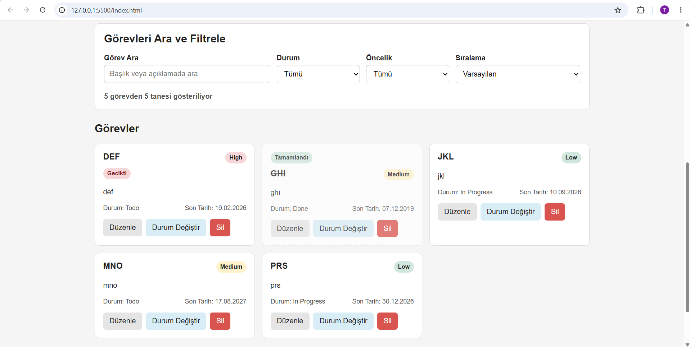

### Breakpoint ile Debug

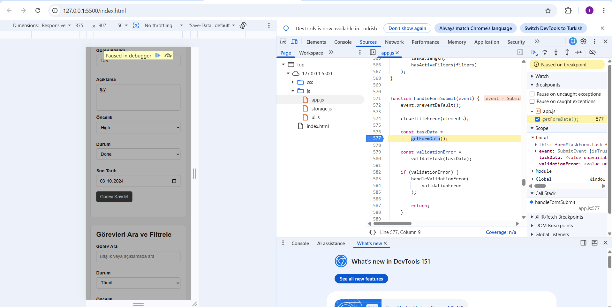

### Bozuk LocalStorage Testi

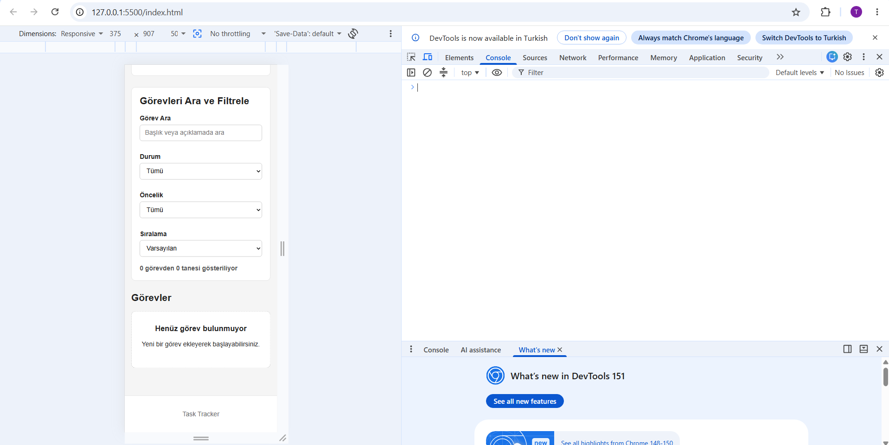

### Console Hatasız Son Durum

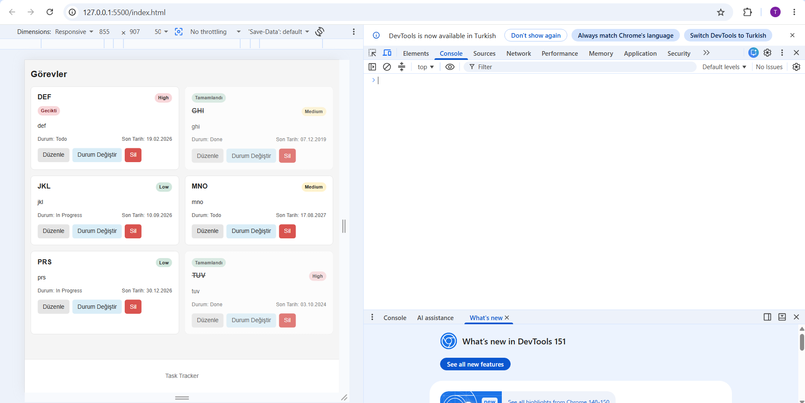

## Bilinen Kısıtlar

- Uygulama verileri yalnızca kullanılan tarayıcının LocalStorage alanında saklanmaktadır.
- Farklı tarayıcı veya cihazlarda aynı görevler otomatik olarak senkronize edilmez.
- Uygulama bir backend veya uzak veritabanı kullanmamaktadır.
- Tarayıcı verileri temizlenirse LocalStorage içerisindeki görevler de silinir.
- ES Modules kullanıldığı için uygulamanın doğrudan `file://` üzerinden açılması tarayıcı güvenlik kısıtlamalarına neden olabilir. Bu nedenle Live Server kullanılması önerilmektedir.

## Gün 30 - Final Sürüm ve Proje Değerlendirmesi

Stajın son gününde Görev Takip Sistemi'nin final sürümünü baştan sona test ettim.

Uygulamayı temiz bir tarayıcı ortamında açarak sıfır görevle doğru şekilde başladığını kontrol ettim. Ardından farklı öncelik, durum ve tarih bilgilerine sahip en az beş görev oluşturarak final demo verisi hazırladım.

Final testlerinde aşağıdaki işlemleri tekrar doğruladım:

- Görev ekleme
- Görev düzenleme
- Görev silme
- Silme işlemini iptal etme
- Görev durumu değiştirme
- Başlık ve açıklamada arama
- Durum ve öncelik filtrelerini birlikte kullanma
- Son tarihe göre sıralama
- Gecikmiş görev görünümü
- Sayfa yenileme sonrası verilerin korunması

### README Kurulum Doğrulaması

GitHub deposunu farklı bir klasöre tekrar klonladım ve README içerisinde bulunan kurulum adımlarını uyguladım.

Projeyi Visual Studio Code ile açarak Live Server üzerinden çalıştırdım. Uygulamanın yeni klasörde sorunsuz şekilde açıldığını ve görev oluşturma işleminin çalıştığını doğruladım.

### Staj Boyunca Öğrendiğim Konular

1. HTML ve semantik sayfa yapısı
2. CSS ve responsive tasarım
3. Flexbox ve CSS Grid
4. JavaScript değişkenleri, koşullar, döngüler ve fonksiyonlar
5. JavaScript Array ve Object yapıları
6. `map`, `filter`, `reduce`, `find` ve `findIndex` metotları
7. DOM manipülasyonu
8. Event yönetimi
9. LocalStorage ve JSON işlemleri
10. CRUD işlemleri
11. Arama, filtreleme ve sıralama
12. Form doğrulama
13. ES Modules, `import` ve `export`
14. Refactor ve tek sorumluluk yaklaşımı
15. Event delegation
16. Chrome DevTools kullanımı
17. Breakpoint ile debugging
18. Git ve GitHub sürüm kontrolü
19. Manuel test senaryoları hazırlama
20. README ve proje dokümantasyonu

### Sonraki Sürümde Yapılabilecekler

- Backend API geliştirilmesi
- Kullanıcı kayıt ve giriş sistemi
- Veritabanı entegrasyonu
- Görev bildirim sistemi
- Otomatik testlerin eklenmesi
- Görev kategorileri ve etiketler
- Kullanıcılar arası veri senkronizasyonu
- Karanlık mod desteği

### Final Ekran Görüntüleri

#### Beş Görevli Final Demo

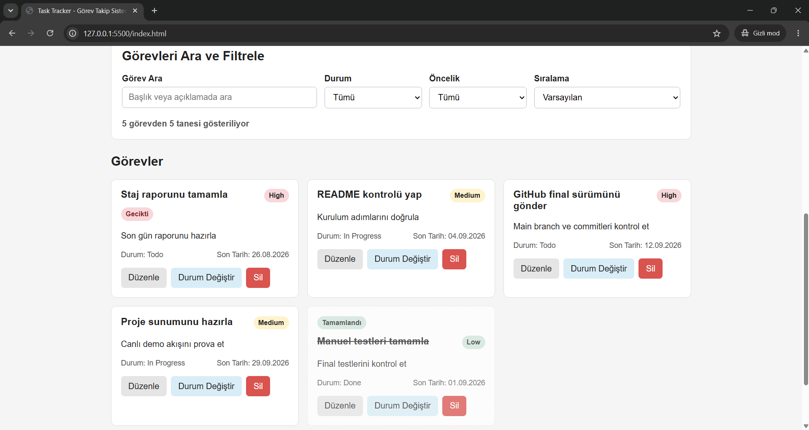

#### Arama ve Filtre Final Testi

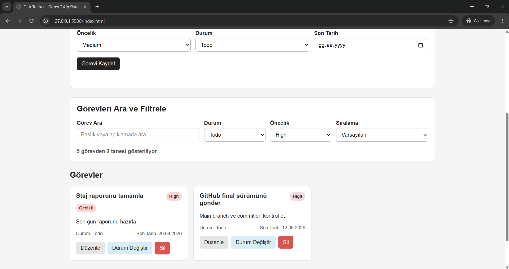

#### Final Uygulama

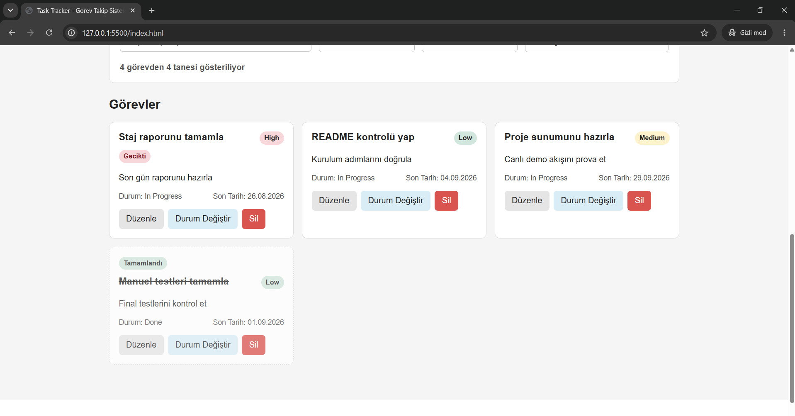

### Final Durumu

Uygulamanın final sürümünde ekleme, düzenleme, silme, durum değiştirme, arama, filtreleme, sıralama, doğrulama ve LocalStorage işlemlerinin çalıştığı doğrulandı.

Proje GitHub üzerinde güncel ve çalışabilir final sürümüne getirildi.